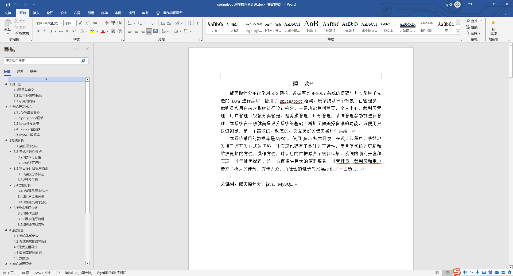
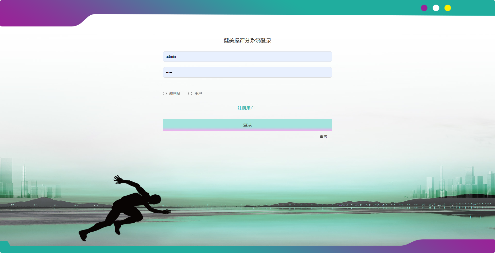
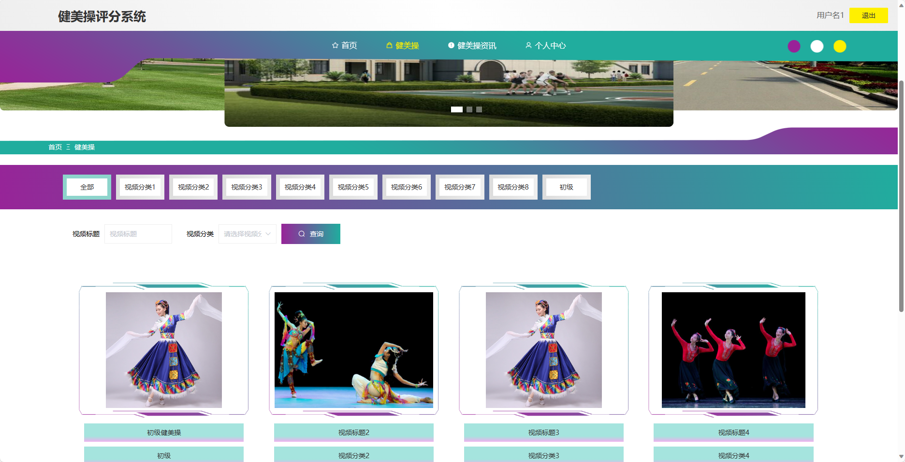
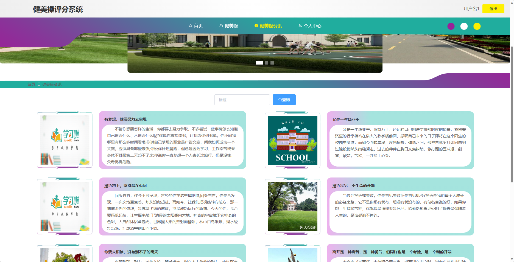
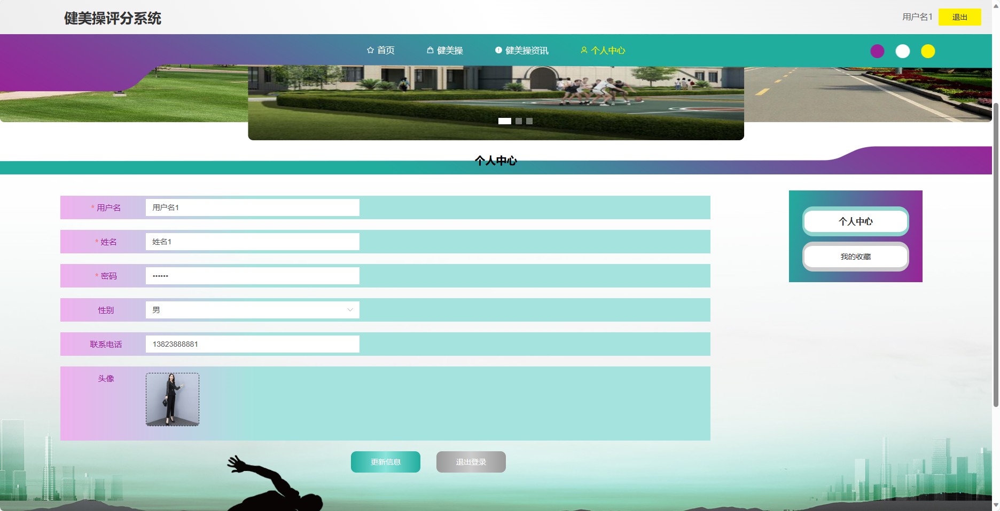
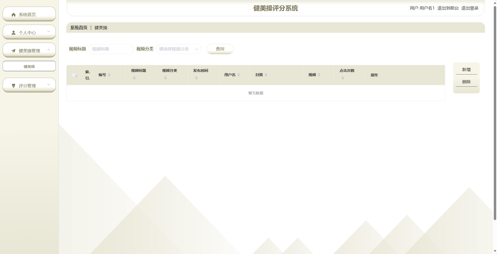
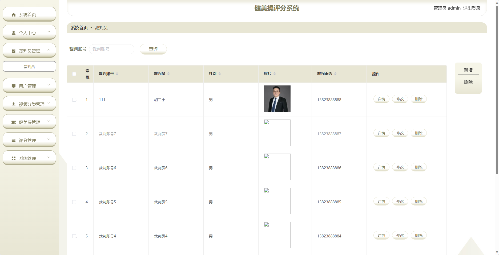
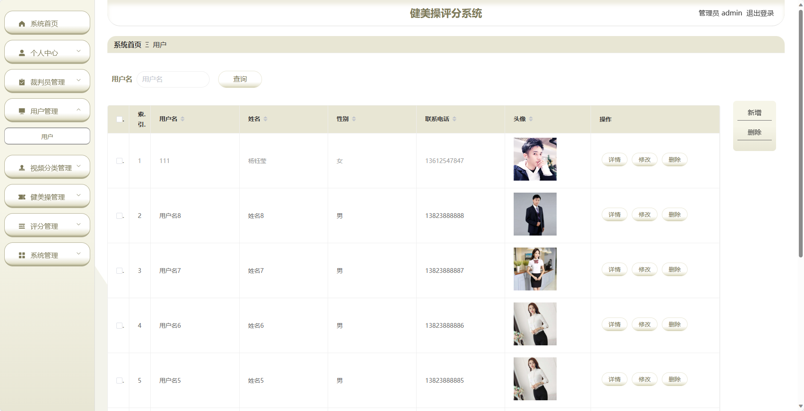
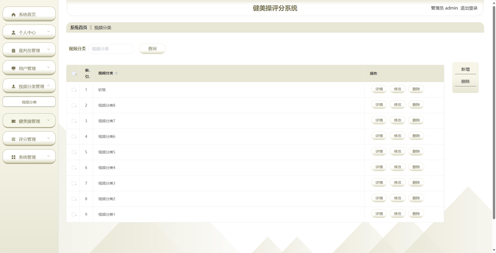
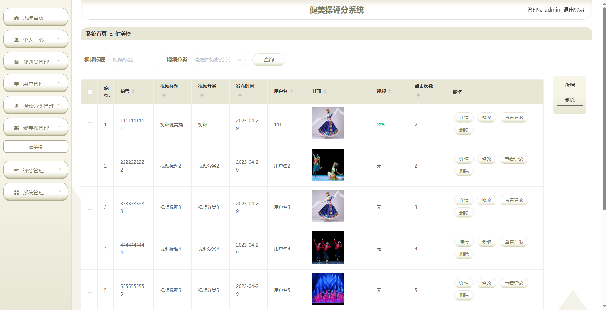

## 基于SpringBoot的健美操评分系统(程序+报告)

- <b>完整代码获取地址：从戎源码网 ([https://armycodes.com/](https://armycodes.com/))</b>
- <b>技术探讨、资料分享，请加QQ群：692619798</b> 
- <b>作者微信：19941326836  QQ：952045282</b> 
- <b>承接计算机毕业设计、Java毕业设计、Python毕业设计、深度学习、机器学习</b>
- <b>选题+开题报告+任务书+程序定制+安装调试+论文+答辩ppt 一条龙服务</b>
- <b>所有选题地址 ([https://github.com/YuLin-Coder/AllProjectCatalog](https://github.com/YuLin-Coder/AllProjectCatalog)) </b>

## 项目介绍
基于SpringBoot的健美操评分系统，系统包含两种角色：管理员、裁判、用户,系统分为前台和后台两大模块，主要功能如下。

### 【管理员】:
1. 个人中心：管理员可以管理个人信息，包括修改密码等操作。
2. 裁判员管理：管理员可以管理裁判员信息，包括查看裁判员列表、添加、编辑、删除等操作。
3. 用户管理：管理员可以管理用户信息，包括查看用户列表、添加、编辑、删除等操作。
4. 视频分类管理：管理员可以管理健美操视频的分类信息，包括添加、编辑、删除等操作。
5. 健美操管理：管理员可以管理健美操视频信息，包括添加、编辑、删除等操作。
6. 评分管理：管理员可以查看用户的评分记录，对评分进行管理和审核。
7. 系统管理：管理员可以管理系统的参数设置、日志查看等功能。

### 【用户】:
1. 个人中心：用户可以管理个人信息，包括修改密码等操作。
2. 健美操管理：用户可以上传自己的健美操视频，进行分享和展示。
3. 评分管理：用户可以查看自己的评分记录。

### 裁判员：
1. 个人中心：裁判员可以管理个人信息，包括修改密码等操作。
2. 健美操管理：裁判员可以查看、审核和评分健美操视频。
3. 评分管理：裁判员可以查看自己的评分记录。

### 【前台】:
1. 首页：展示健美操评分系统的概览信息，包括最新的健美操比赛、热门视频等。
2. 健美操：展示各种健美操视频，用户可以观看并进行评分。
3. 健美操资讯：提供关于健美操的最新资讯和活动信息。
4. 个人中心：用户可以管理个人信息，包括修改密码、查看评分记录等操作。

## 项目技术
- 编程语言：Java
- 数据库：MySQL
- 项目管理工具：Maven
- 前端技术：HTML、CSS、JavaScript、Jquery、Vue
- 后端技术：Spring、SpringMVC、MyBatis

## 运行环境
- JDK版本：JDK1.8及以上
- 开发工具：IDEA、Ecplise、Myecplise都可以
- 数据库: MySQL5.7及以上
- Maven：maven3.0及以上
- Node：14.14.0及以上

## 运行截图

